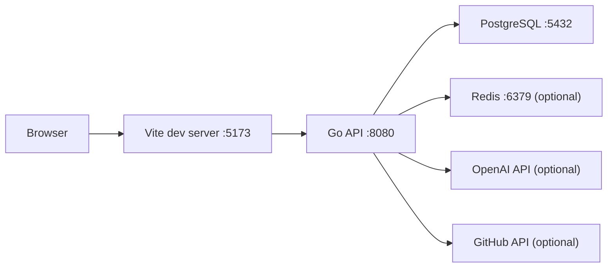
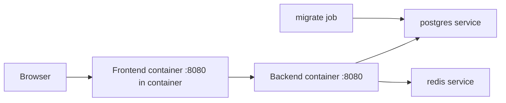
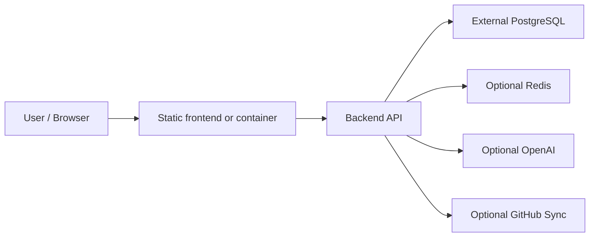

# Skill Hub Architecture

本文档描述当前仓库的技术边界、资源生命周期、数据流和运维约束。

## 1. 系统概览

Skill Hub 是一个前后端分离的内容平台：

- [frontend/](./frontend/)
  - React + Vite
  - 页面、路由、上传表单、详情页、资料页、审核页
  - 通过统一请求层访问 backend API
- [backend/](./backend/)
  - Go + Gin + GORM
  - 认证、资源管理、AI 审核、人工复核、GitHub 同步、统计
- [db/](./db/)
  - PostgreSQL schema、migration、seed
- [infra/](./infra/)
  - 本地 PostgreSQL / Redis 编排

## 2. 资源模型

当前有两类资源生命周期：

### 2.1 Reviewed Resources

- `skill`
- `rules`

特点：

- 上传后进入 AI 审核
- AI 通过后进入人工复核
- 人工通过后才视为正式发布
- 后续更新走 revision 流，而不是直接覆盖线上可见版本
- `skill` 可选 GitHub 同步；`rules` 不依赖 GitHub 同步

### 2.2 Auto-Published Resources

- `mcp`
- `tools`

特点：

- 上传后直接标记为已通过、已发布
- 不进入 AI 审核和人工复核
- 更新时直接更新当前资源，不创建待审核 revision

## 3. 运行拓扑

### 本地宿主机开发



### Docker Compose 本地栈



### 共享环境 / 生产环境



## 4. 前端架构

核心特点：

- 根应用由 [frontend/src/App.tsx](./frontend/src/App.tsx) 组织
- 顶层有全局 [AppErrorBoundary.tsx](./frontend/src/components/AppErrorBoundary.tsx)
- 鉴权由 [AuthContext.tsx](./frontend/src/contexts/AuthContext.tsx) 维护
- API 请求经由共享层 [request.ts](./frontend/src/services/api/request.ts)
- token 存在 `localStorage`
- 鉴权请求收到 `401` 会自动 logout

页面层面：

- 首页与资源列表：[frontend/src/features/home/HomePage.tsx](./frontend/src/features/home/HomePage.tsx)
- 详情页：[frontend/src/features/skill-detail/SkillDetailPage.tsx](./frontend/src/features/skill-detail/SkillDetailPage.tsx)
- 上传页：[frontend/src/features/upload/](./frontend/src/features/upload/)
- 审核页：[frontend/src/features/review/ReviewPage.tsx](./frontend/src/features/review/ReviewPage.tsx)
- 资料页：[frontend/src/features/profile/ProfilePage.tsx](./frontend/src/features/profile/ProfilePage.tsx)

## 5. 后端架构

### 5.1 入口层

- 服务入口：[backend/cmd/server/main.go](./backend/cmd/server/main.go)
- migration 入口：[backend/cmd/migrate/main.go](./backend/cmd/migrate/main.go)
- 本地清库入口：[backend/cmd/clear-db/main.go](./backend/cmd/clear-db/main.go)

### 5.2 关键模块

- 配置：[backend/internal/config/](./backend/internal/config/)
- 中间件：[backend/internal/middleware/](./backend/internal/middleware/)
- HTTP handler：[backend/internal/handler/](./backend/internal/handler/)
- 业务服务：[backend/internal/service/](./backend/internal/service/)
- 结构化日志：[backend/internal/logging/](./backend/internal/logging/)

### 5.3 中间件与运行时安全

当前服务启动链路已经挂载：

- CORS allowlist
- 安全响应头
- 上传请求体限制
- 登录 / 注册 / review retry / AI chat 速率限制
- `/health` 健康检查

关键实现：

- [backend/internal/middleware/cors.go](./backend/internal/middleware/cors.go)
- [backend/internal/middleware/security_headers.go](./backend/internal/middleware/security_headers.go)
- [backend/internal/middleware/rate_limit.go](./backend/internal/middleware/rate_limit.go)

## 6. 数据边界

### PostgreSQL

PostgreSQL 是唯一主业务数据库。

业务 schema 只来自：

- [db/migrations/](./db/migrations/)

backend 启动时不会自动建表。

### 文件系统

backend 仍使用本地文件目录保存二进制/派生资源：

- `backend/uploads`
- `backend/thumbnails`
- `backend/avatars`

### Redis

Redis 是可选缓存层，不是主数据源。

当前主要用于：

- AI skills 上下文缓存
- 速率限制存储优先层

## 7. 认证与会话

- 当前鉴权是 Bearer token，不是 Cookie session
- frontend 使用 JWT + `localStorage`
- backend 用 `Authorization: Bearer ...`
- token 解析失败或过期时，鉴权 API 返回 `401`
- frontend 统一把带鉴权 `401` 视为会话失效

## 8. 用户资料页数据流

早期资料页通过“抓全站前 500 条再前端过滤”的方式工作。当前已经改成服务端专用接口：

- `GET /api/me/uploads`

该接口返回：

- 分页后的当前用户上传资源
- 上传统计
- top tags
- recent activities

对应实现：

- [backend/internal/handler/profile_handlers.go](./backend/internal/handler/profile_handlers.go)
- [backend/internal/service/profile.go](./backend/internal/service/profile.go)

## 9. 日志与可观测性

当前日志策略：

- `local` / `test`：文本 `slog`
- 非本地环境：JSON `slog`

健康检查：

- backend：`/health`
- compose healthcheck 会主动探测 `backend /health`

## 10. 容器与部署约束

- backend 容器以普通用户 `skillhub` 运行
- frontend 容器以普通用户 `nginx` 运行
- frontend 容器内部监听 `8080`
- 生产发布顺序固定：

```text
migrate -> backend -> frontend
```

## 11. 测试模型

### backend

- 使用 PostgreSQL 测试环境
- 按 migration 建 schema
- 每个测试隔离 schema

### frontend

- 当前以 `npm run build` 为主校验
- 关键轻量逻辑使用 Node test
- 包括请求层、README 缓存、Dialog Escape、AI 鼠标调度、Docker 运行时约束
