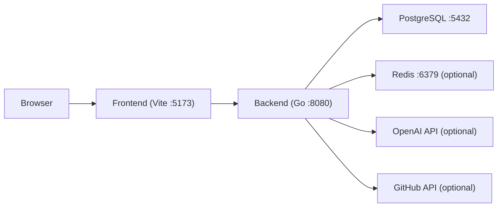
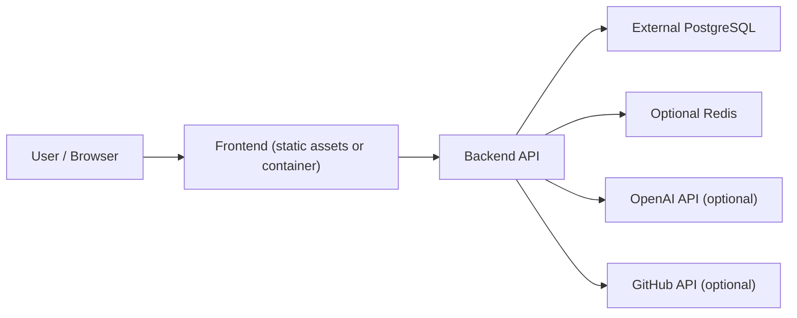

# Skill Hub Architecture

本文档解释这套仓库当前的技术边界、目录职责、数据流和运行方式。目标是让新的维护者可以快速判断：

- 哪个目录负责什么
- 本地怎么启动
- 共享环境/生产环境怎么部署
- 数据存在哪里
- 测试依赖什么

## 1. 系统概览

Skill Hub 采用前后端分离架构：

- `frontend/`
  - React + Vite
  - 负责页面渲染、路由、前端状态和 API 调用
  - 只消费后端 API
  - 只使用公开环境变量
- `backend/`
  - Go + Gin + GORM
  - 负责认证、资源管理、AI 审核、GitHub 同步、收藏点赞下载统计
  - 通过 `DATABASE_URL` 连接 PostgreSQL
- `db/`
  - `init/`：本地 PostgreSQL 初始化脚本
  - `migrations/`：正式业务 schema 来源
  - `seed/`：本地演示数据
- `infra/`
  - 本地基础设施
  - 当前主要提供 PostgreSQL 和 Redis

## 2. 仓库结构

```text
Skill_Hub/
├── backend/
│   ├── cmd/
│   │   ├── server/          后端 API 入口
│   │   ├── migrate/         migration 执行入口
│   │   └── clear-db/        本地清库入口
│   └── internal/
│       ├── config/          配置加载
│       ├── database/        migration 封装
│       ├── handler/         HTTP handler
│       ├── model/           GORM model
│       ├── service/         业务逻辑
│       └── testutil/        PostgreSQL 测试 helper
├── frontend/
│   ├── src/                 React 业务代码
│   ├── public/              静态资源
│   ├── Dockerfile           前端镜像构建
│   └── nginx.conf           容器内 Nginx 反代配置
├── db/
│   ├── init/
│   ├── migrations/
│   └── seed/
├── infra/docker/
│   └── compose.local.yml    本地 PostgreSQL / Redis
├── scripts/
│   ├── db-local.sh
│   ├── run-all-migrations.sh
│   ├── seed-local.sh
│   └── clear-db-data.sh
└── .github/workflows/
    └── verify.yml           GitHub Actions 校验流水线
```

## 3. 运行拓扑

### 本地开发



特点：

- PostgreSQL 和 Redis 通常由 `./scripts/db-local.sh` 启动
- backend 和 frontend 通常单独运行，便于本地调试
- backend 测试依赖 PostgreSQL，但不依赖 frontend/backend dev server 已启动

### 共享环境 / 生产环境



特点：

- PostgreSQL 应独立部署，不跟应用容器耦合在一起
- backend 与 frontend 可分别部署和回滚
- 发布顺序固定为：`migrate -> backend -> frontend`

## 4. 请求与数据流

### 资源读取流

1. 浏览器访问 frontend
2. frontend 调用 `/api/...`
3. backend 查询 PostgreSQL
4. backend 按需访问 Redis / OpenAI / GitHub
5. backend 返回 JSON 给 frontend

### 资源上传流

1. 用户从 frontend 提交表单或文件
2. backend 处理上传、入库、生成资源记录
3. backend 根据资源类型触发 AI 审核或人工复核逻辑
4. 如果开启 GitHub 同步，`skill` 资源可同步到 GitHub

### 数据变更流

1. 开发者新增 migration 文件
2. 本地或测试环境先执行 migration
3. 共享环境 / 生产环境发布前先执行 migration
4. migration 成功后再发布 backend 和 frontend

## 5. 数据边界

### PostgreSQL

PostgreSQL 是主业务数据库。当前核心表：

- `users`
- `skills`
- `skill_likes`
- `skill_favorites`

约束：

- 业务 schema 只来自 `db/migrations/`
- backend 启动时不负责建表
- 不允许依赖 `AutoMigrate`

### 文件系统

后端本地文件目录仍用于存储资源文件：

- `uploads/`
- `thumbnails/`
- `avatars/`

这些目录属于应用资源目录，不是主数据库。

### Redis

Redis 只做可选缓存：

- AI 上下文缓存
- 失效广播

Redis 不是主数据源。

## 6. 配置模型

### Backend

backend 主要使用运行时环境变量：

- `APP_ENV`
- `PORT`
- `DATABASE_URL`
- `JWT_SECRET`
- `REDIS_*`
- `OPENAI_*`
- `GITHUB_*`

本地开发可使用：

- `backend/.env.local`

共享环境与生产环境建议由部署系统或 secret 管理工具注入环境变量，不依赖仓库内真实 `.env` 文件。

### Frontend

frontend 只允许公开配置：

- `VITE_APP_ENV`
- `VITE_API_BASE_URL`

前端不会持有：

- 数据库连接串
- JWT secret
- OpenAI key
- GitHub token

## 7. 启动模型

### 本地启动

推荐顺序：

1. `./scripts/db-local.sh`
2. `./scripts/run-all-migrations.sh`
3. `./scripts/seed-local.sh`（可选）
4. `cd backend && go run cmd/server/main.go`
5. `cd frontend && npm run dev`

### 部署启动

固定顺序：

1. 执行 migration
2. 发布 backend
3. 发布 frontend

即：

```text
migrate -> backend -> frontend
```

## 8. 测试与 CI

### 本地验证

当前最重要的本地校验命令：

- `./scripts/run-all-migrations.sh`
- `cd backend && go test ./...`
- `cd frontend && npm run build`

### backend 测试模型

backend 测试已经统一切到 PostgreSQL：

- 使用 `backend/internal/testutil/postgres.go`
- 每个测试创建独立 schema
- 执行正式 migration
- 测试结束后自动清理 schema

这保证测试语义更接近真实生产数据库，而不是 SQLite 特化行为。

### GitHub Actions

仓库内 GitHub Actions workflow：

- `.github/workflows/verify.yml`

负责：

- backend test
- frontend build

不负责：

- 生产部署
- 数据库上线变更执行
- 环境发布编排

## 9. 迁移策略

迁移采用 migration-first：

- 不允许应用启动自动改表
- 新增 schema 变化必须是显式 migration
- 默认优先非破坏性变更
- 破坏性变更使用 expand-and-contract

例如重命名或替换字段时：

1. 新增新列
2. 回填旧数据
3. backend 切到新列
4. frontend 如有需要再跟进
5. 稳定后再删旧列

## 10. 运维边界

这套仓库目前已经具备：

- PostgreSQL 明确 migration 管理
- 本地基础设施脚本
- backend/frontend 分离发布
- GitHub Actions 基础校验

但企业环境通常还会额外补：

- TLS / 统一网关
- 监控 / 告警 / 日志采集
- 备份 / 快照 / 恢复演练
- Secret 管理
- 权限与审计体系

## 11. 相关文档

- [README.md](./README.md)
- [DEPLOYMENT.md](./DEPLOYMENT.md)
- [GITHUB_ACTIONS.md](./GITHUB_ACTIONS.md)
- [CI_CD_TEMPLATE.md](./CI_CD_TEMPLATE.md)
