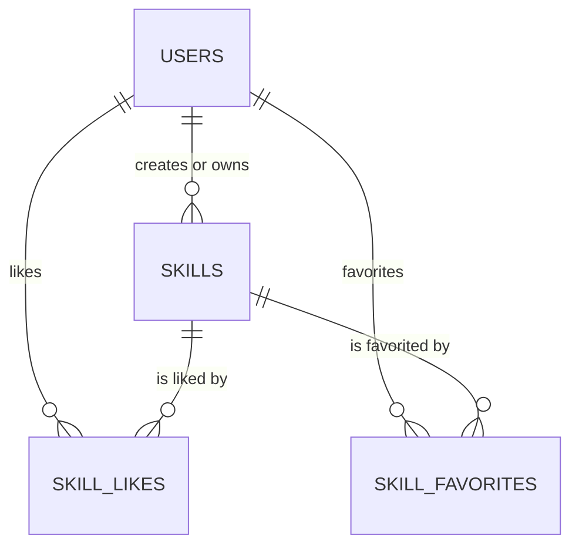

# Database Schema

这份文档描述当前 Skill Hub 的数据库结构，面向项目维护者和业务开发者，不按 DBA 术语堆砌，而是解释：

- 现在数据库里有哪些表
- 每张表是干什么的
- 关键字段代表什么
- 几个状态字段怎么理解
- 表和表之间是什么关系

当前正式 schema 来源是：

- [db/migrations/0001_init_schema.up.sql](./migrations/0001_init_schema.up.sql)

如果以后新增 migration，这份文档也要一起更新。

## 1. 当前有哪些表

目前主业务表只有 4 张：

1. `users`
2. `skills`
3. `skill_likes`
4. `skill_favorites`

注意：

- 当前 migration 里没有显式外键约束
- 也就是说，表关系主要靠业务代码保证，而不是数据库 `FOREIGN KEY`

## 2. 表关系

可以先把它理解成下面这样：

补充说明：

- `skills.user_id` 代表资源归属用户
- `skill_likes` 是用户和资源的点赞关系表
- `skill_favorites` 是用户和资源的收藏关系表

## 3. users 表

### 这张表是干什么的

存平台用户账号信息。

### 字段说明

| 字段 | 类型 | 说明 |
|---|---|---|
| `id` | `BIGSERIAL` | 用户主键 |
| `username` | `VARCHAR(50)` | 用户名，唯一 |
| `password` | `TEXT` | 登录密码的哈希值，不是明文 |
| `avatar_url` | `VARCHAR(512)` | 头像访问地址，通常是后端 `/api/avatars/...` 路径 |
| `created_at` | `TIMESTAMPTZ` | 创建时间 |
| `updated_at` | `TIMESTAMPTZ` | 更新时间 |

### 索引

- `idx_users_username`：用户名唯一索引

### 你最常关心什么

- 用户登录注册主要看这张表
- 密码是哈希，不应该直接人工改成明文

## 4. skills 表

### 这张表是干什么的

这是核心业务表。  
不只是传统意义上的 “skill”，现在 `rules / mcp / tools` 也都统一存在这张表里，用 `resource_type` 区分。

### 这张表里的数据大致分几块

可以按业务理解成 6 组字段：

1. 基础信息
2. 文件与展示信息
3. 统计信息
4. AI 审核信息
5. 人工复核信息
6. GitHub 同步信息

### 字段说明

#### 4.1 基础信息

| 字段 | 类型 | 说明 |
|---|---|---|
| `id` | `BIGSERIAL` | 资源主键 |
| `user_id` | `BIGINT` | 资源所属用户 ID |
| `name` | `VARCHAR(255)` | 资源名称 |
| `description` | `TEXT` | 资源描述 |
| `category` | `VARCHAR(100)` | 分类 |
| `tags` | `TEXT` | 标签，当前是文本存储 |
| `resource_type` | `VARCHAR(50)` | 资源类型，当前业务上常见为 `skill / rules / mcp / tools` |
| `author` | `VARCHAR(100)` | 展示用作者名 |

#### 4.2 文件与展示信息

| 字段 | 类型 | 说明 |
|---|---|---|
| `file_name` | `VARCHAR(255)` | 上传文件名 |
| `file_path` | `VARCHAR(512)` | 后端本地文件路径 |
| `file_size` | `BIGINT` | 文件大小 |
| `thumbnail_url` | `VARCHAR(512)` | 缩略图访问地址 |

#### 4.3 统计信息

| 字段 | 类型 | 说明 |
|---|---|---|
| `downloads` | `BIGINT` | 下载次数 |
| `likes_count` | `BIGINT` | 点赞总数 |

#### 4.4 AI 审核信息

| 字段 | 类型 | 说明 |
|---|---|---|
| `ai_approved` | `BOOLEAN` | AI 是否判定通过 |
| `ai_review_status` | `VARCHAR(32)` | AI 审核总体状态 |
| `ai_review_phase` | `VARCHAR(32)` | AI 审核当前阶段 |
| `ai_review_attempts` | `INTEGER` | 当前已尝试次数 |
| `ai_review_max_attempts` | `INTEGER` | 最大尝试次数 |
| `ai_review_started_at` | `TIMESTAMPTZ` | AI 审核开始时间 |
| `ai_review_completed_at` | `TIMESTAMPTZ` | AI 审核结束时间 |
| `ai_review_details` | `TEXT` | AI 审核细节 |
| `ai_feedback` | `TEXT` | AI 反馈内容 |
| `ai_description` | `TEXT` | AI 生成的展示摘要 |

#### 4.5 人工复核信息

| 字段 | 类型 | 说明 |
|---|---|---|
| `human_review_status` | `VARCHAR(32)` | 人工复核状态 |
| `human_reviewer_id` | `BIGINT` | 复核人用户 ID |
| `human_reviewer` | `VARCHAR(100)` | 复核人展示名 |
| `human_review_feedback` | `TEXT` | 人工复核意见 |
| `human_reviewed_at` | `TIMESTAMPTZ` | 人工复核时间 |
| `published` | `BOOLEAN` | 是否已对外发布 |

#### 4.6 GitHub 同步信息

| 字段 | 类型 | 说明 |
|---|---|---|
| `github_path` | `VARCHAR(1024)` | 同步到 GitHub 后的路径 |
| `github_url` | `VARCHAR(1024)` | GitHub 页面地址 |
| `github_files` | `TEXT` | GitHub 文件清单 |
| `github_sync_status` | `VARCHAR(32)` | GitHub 同步状态 |
| `github_sync_error` | `TEXT` | GitHub 同步失败原因 |

#### 4.7 时间字段

| 字段 | 类型 | 说明 |
|---|---|---|
| `created_at` | `TIMESTAMPTZ` | 资源创建时间 |
| `updated_at` | `TIMESTAMPTZ` | 资源更新时间 |

### 索引

当前这张表上有这些索引：

- `idx_skills_user_id`
- `idx_skills_resource_type`
- `idx_skills_ai_review_status`
- `idx_skills_human_review_status`
- `idx_skills_human_reviewer_id`
- `idx_skills_published`

### 你最常关心什么

实际排查问题时，最常用的是这几个字段组合：

1. `resource_type`
看当前记录到底是 `skill`、`rules`、`mcp` 还是 `tools`

2. `ai_approved + ai_review_status + ai_review_phase`
看 AI 审核跑到哪一步、有没有失败、失败是否可重试

3. `human_review_status + published`
看资源有没有经过人工复核，以及是否真正对外可见

4. `github_sync_status + github_sync_error`
看 Skill 资源同步 GitHub 有没有成功

## 5. skill_likes 表

### 这张表是干什么的

记录“哪个用户给哪个资源点过赞”。

### 字段说明

| 字段 | 类型 | 说明 |
|---|---|---|
| `id` | `BIGSERIAL` | 主键 |
| `skill_id` | `BIGINT` | 被点赞的资源 ID |
| `user_id` | `BIGINT` | 点赞用户 ID |
| `created_at` | `TIMESTAMPTZ` | 点赞时间 |

### 索引

- `idx_skill_user_like`：唯一索引，保证同一个用户不能对同一条资源重复点赞

### 你最常关心什么

- 这张表存“关系”
- `skills.likes_count` 存“汇总值”
- 两边理论上应该一致，排查点赞异常时要一起看

## 6. skill_favorites 表

### 这张表是干什么的

记录“哪个用户收藏了哪个资源”。

### 字段说明

| 字段 | 类型 | 说明 |
|---|---|---|
| `id` | `BIGSERIAL` | 主键 |
| `skill_id` | `BIGINT` | 被收藏的资源 ID |
| `user_id` | `BIGINT` | 收藏用户 ID |
| `created_at` | `TIMESTAMPTZ` | 收藏时间 |

### 索引

- `idx_skill_user_favorite`：唯一索引，保证同一个用户不能重复收藏同一条资源

## 7. 状态字段怎么理解

### human_review_status

当前代码里这几个值最重要：

| 值 | 含义 |
|---|---|
| `pending` | 等待人工复核 |
| `approved` | 人工复核通过 |
| `rejected` | 人工复核拒绝 |

一般理解：

- `approved` 往往意味着这条资源可以发布
- `rejected` 往往意味着这条资源不能公开展示

### ai_review_status

当前代码里定义了这些值：

| 值 | 含义 |
|---|---|
| `queued` | 已进入队列，等待 AI 审核 |
| `running` | 正在审核 |
| `passed` | AI 审核通过 |
| `failed_retryable` | AI 审核失败，但可重试 |
| `failed_terminal` | AI 审核失败，且视为终态 |

### ai_review_phase

当前代码里定义了这些阶段：

| 值 | 含义 |
|---|---|
| `queued` | 尚未开始 |
| `security` | 安全性检查 |
| `functional` | 功能性检查 |
| `finalizing` | 结果整理 |
| `done` | 全流程完成 |

### github_sync_status

当前代码里会出现这些值：

| 值 | 含义 |
|---|---|
| `disabled` | GitHub 同步未启用 |
| `not_started` | 已具备同步条件，但还没开始 |
| `pending` | 正在同步 |
| `success` | 同步成功 |
| `failed` | 同步失败 |

## 8. 当前 schema 的几个关键事实

1. 主业务表目前只有 4 张
还没有拆出更细的审核表、附件表、标签表

2. `skills` 是资源总表
不是只有“技能”，`rules / mcp / tools` 也共用它

3. 数据库里没有显式外键
当前主要靠应用层逻辑维护引用关系

4. 点赞和收藏是关系表
而点赞总数存回 `skills.likes_count`

5. schema 变更必须走 migration
不能靠 backend 启动自动改表

## 9. 以后怎么看数据库有没有变化

以后如果你想确认数据库结构有没有变化，优先看这几个地方：

1. [db/migrations/](./migrations/)
最权威，数据库最终长什么样，以这里为准

2. [backend/internal/model/skill.go](/Users/qianjianghao/Desktop/Skill_Hub/backend/internal/model/skill.go)
看业务代码怎么读写这些字段

3. [backend/internal/model/user.go](/Users/qianjianghao/Desktop/Skill_Hub/backend/internal/model/user.go)
4. [backend/internal/model/skill_like.go](/Users/qianjianghao/Desktop/Skill_Hub/backend/internal/model/skill_like.go)
5. [backend/internal/model/skill_favorite.go](/Users/qianjianghao/Desktop/Skill_Hub/backend/internal/model/skill_favorite.go)

## 10. 以后改表时，这份文档怎么维护

推荐规则：

1. 新增 migration 时，如果影响 schema，就同步更新 `db/SCHEMA.md`
2. 先改 migration，再更新文档，不要反过来
3. 文档写“业务含义”，不要只复制 SQL
4. 如果新增状态字段，一定补状态值含义
