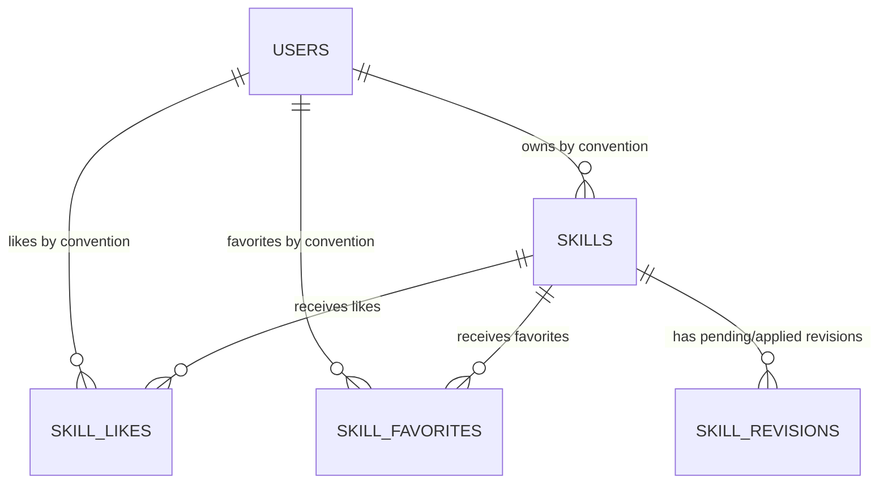

# Database Schema Guide

这份文档是 Skill Hub 当前数据库的总说明。它不只讲“表长什么样”，还会解释：

- `db/` 目录下每个文件夹和每个文件是干什么的
- 哪些 SQL 会在本地初始化时执行，哪些 SQL 才是正式业务 schema
- 当前 PostgreSQL 里有哪些业务表、字段、索引和约束
- `up` / `down` migration 在部署时分别意味着什么

如果你只想知道“数据库现在到底长什么样”，先看：

1. `db/migrations/*.up.sql`
2. 这份文档
3. `backend/internal/model/*.go`

## 1. 当前数据库的基本原则

这个仓库当前使用 PostgreSQL，并且遵守 migration-first 规则：

- backend 启动时不自动改表
- 正式业务 schema 只来自 `db/migrations/`
- `db/init/` 只负责本地数据库初始化，不承担业务建表
- `db/seed/` 只负责可选的本地演示数据，不属于正式 schema

当前正式业务 schema 由下面三组 migration 共同定义：

- `db/migrations/0001_init_schema.up.sql`
- `db/migrations/0002_add_skill_revisions.up.sql`
- `db/migrations/0003_add_engagement_foreign_keys.up.sql`

如果你将来再新增 `0004_xxx.up.sql`，这份文档也必须同步更新。

## 2. `db/` 目录结构说明

当前 `db/` 目录结构如下：

```text
db/
├── SCHEMA.md
├── init/
│   └── 001-extensions.sql
├── migrations/
│   ├── 0001_init_schema.up.sql
│   ├── 0001_init_schema.down.sql
│   ├── 0002_add_skill_revisions.up.sql
│   ├── 0002_add_skill_revisions.down.sql
│   ├── 0003_add_engagement_foreign_keys.up.sql
│   └── 0003_add_engagement_foreign_keys.down.sql
└── seed/
    └── local_seed.sql
```

下面按文件夹和文件分别说明。

## 3. `db/` 下每个文件夹、每个文件是干什么的

### 3.1 `db/SCHEMA.md`

就是你现在看的这份文档。

用途：

- 解释数据库目录结构
- 解释每个 SQL 文件的职责
- 解释当前表结构和业务含义
- 给后续维护 migration 的人一个统一参考

### 3.2 `db/init/`

这个目录放“本地数据库初始化 SQL”。

特点：

- 由 `./scripts/local.sh db up` 间接执行
- 目标是把本地 PostgreSQL 环境准备好
- 不承担业务建表，不应该把业务 schema 写在这里

#### `db/init/001-extensions.sql`

当前内容：

- `CREATE EXTENSION IF NOT EXISTS pgcrypto;`

用途：

- 在本地 PostgreSQL 中启用 `pgcrypto` 扩展
- 这是幂等的，重复执行不会报重复创建错误

你可以把它理解成“数据库运行环境准备”，不是“业务表结构变更”。

### 3.3 `db/migrations/`

这个目录是最重要的目录，放正式业务 schema 的版本化 SQL。

特点：

- 由 `./scripts/local.sh migrate` 或 `docker compose` 中的 `migrate` 服务执行
- 使用 `golang-migrate` 按版本顺序执行
- `.up.sql` 表示正向升级
- `.down.sql` 表示回滚脚本
- 生产和共享环境要以这里为准

#### `db/migrations/0001_init_schema.up.sql`

作用：

- 初始化第一版核心业务表
- 创建 `users`
- 创建 `skills`
- 创建 `skill_likes`
- 创建 `skill_favorites`
- 同时创建这些表对应的索引

这是最早的业务 schema 基线。

#### `db/migrations/0001_init_schema.down.sql`

作用：

- 回滚 `0001` 这一版 schema
- 会依次删除 `skill_favorites`、`skill_likes`、`skills`、`users`

注意：

- 这个文件是“回滚脚本”，不是正常部署时会自动运行的脚本
- 如果你对已部署数据库手动执行它，已有业务数据会被删除

#### `db/migrations/0002_add_skill_revisions.up.sql`

作用：

- 在 `0001` 的基础上新增 `skill_revisions` 表
- 为 `skill_revisions` 建立常用索引
- 增加一个部分唯一索引，保证同一个 `skill_id` 只能有一条 `status = 'pending'` 的 revision

这一版的意义是把“已发布资源”和“待审核更新”拆开存储。

#### `db/migrations/0002_add_skill_revisions.down.sql`

作用：

- 删除 `skill_revisions` 表及其索引

同样注意：

- 它只属于回滚路径
- 正常上线执行 migration 时不会自动跑到这里

#### `db/migrations/0003_add_engagement_foreign_keys.up.sql`

作用：

- 为 `skill_likes` 和 `skill_favorites` 补齐外键约束
- 让点赞、收藏数据和 `users`、`skills` 之间的引用关系更可靠
- 用 `ON DELETE CASCADE` 保证主记录删除后关联记录同步清理

#### `db/migrations/0003_add_engagement_foreign_keys.down.sql`

作用：

- 回滚 `0003` 中新增的外键约束

### 3.4 `db/seed/`

这个目录放“可选的本地种子数据”。

特点：

- 由 `./scripts/local.sh seed` 执行
- 主要用于本地开发、联调、演示
- 不属于正式 schema 的一部分
- 不应该被当成生产初始化脚本

#### `db/seed/local_seed.sql`

当前作用：

- 如果不存在 `local-admin`，插入一个本地管理员账号
- 如果不存在 `Local Demo Skill`，插入一条演示资源

特点：

- 它带了 `WHERE NOT EXISTS` 判断，避免最基础的重复插入
- 它只适合本地开发，不适合当生产初始化基线

## 4. 这些文件在实际流程里怎么被使用

### 4.1 本地宿主机开发流程

最常见顺序是：

```text
./scripts/local.sh db up
-> ./scripts/local.sh migrate
-> ./scripts/local.sh seed   (可选)
-> 启动 backend / frontend
```

对应职责：

- `./scripts/local.sh db up`：启动本地 PostgreSQL / Redis，并准备数据库运行环境
- `./scripts/local.sh migrate`：执行 `db/migrations/*.up.sql`
- `./scripts/local.sh seed`：把 `db/seed/local_seed.sql` 灌进本地库

### 4.2 容器完整栈开发流程

根目录 `docker-compose.yml` 的完整本地栈里，migration 会自动执行，但 seed 不会自动执行。

原因很简单：

- schema 是环境必需品，应该自动到位
- seed 是演示数据，不应该在每次启动都自动灌入

### 4.3 生产或共享环境部署流程

部署顺序应该是：

```text
migrate -> backend -> frontend
```

这里真正会跑的是：

- `db/migrations/*.up.sql`

正常部署不会自动执行：

- `db/migrations/*.down.sql`
- `db/seed/local_seed.sql`

## 5. 正常部署时会不会先 drop 再新增

不会。

当前迁移执行器只调用 `Up()`，也就是只跑正向 migration。

具体实现可以看：

- `backend/internal/database/migrator.go`
- `backend/cmd/migrate/main.go`

所以：

- 正常执行 `./scripts/local.sh migrate` 时，不会先执行 `.down.sql`
- 已经执行过的 migration 不会重复执行
- 新部署只会继续向前执行新的版本，例如未来的 `0004_xxx.up.sql`

你看到的 `DROP TABLE` / `DROP INDEX`，是给“手动回滚”准备的，不是给“正常升级”准备的。

## 6. 当前数据库里有哪些表

如果只看业务表，当前主要有 5 张：

1. `users`
2. `skills`
3. `skill_likes`
4. `skill_favorites`
5. `skill_revisions`

此外，运行 migration 后通常还会看到一个 `schema_migrations` 表：

- 这是 `golang-migrate` 自己维护的版本记录表
- 它不是业务表
- 不要把它当成业务数据表去改

## 7. 表关系总览

可以先把当前关系理解成下面这样：



关键点：

- `skill_revisions.skill_id -> skills.id` 是当前唯一明确写进 migration 的外键
- `skill_likes.skill_id`
- `skill_favorites.skill_id`
- `skills.user_id`
- `skill_likes.user_id`
- `skill_favorites.user_id`

这些字段在当前 schema 里都没有显式外键约束，主要靠应用层逻辑保证。

也就是说，当前数据库约束和业务约束是混合存在的：

- PostgreSQL 真正强制的：主键、唯一索引、`skill_revisions.skill_id` 外键、非空约束、默认值
- 应用层约定保证的：资源归属用户、点赞/收藏关联的引用完整性

## 8. 每张表详细说明

### 8.1 `users`

用途：

- 存平台账号

字段说明：

| 字段 | 类型 | 含义 |
|---|---|---|
| `id` | `BIGSERIAL` | 用户主键 |
| `username` | `VARCHAR(50)` | 用户名，要求唯一 |
| `password` | `TEXT` | 密码哈希，不是明文 |
| `avatar_url` | `VARCHAR(512)` | 头像访问地址 |
| `created_at` | `TIMESTAMPTZ` | 创建时间 |
| `updated_at` | `TIMESTAMPTZ` | 更新时间 |

索引和约束：

- 主键：`id`
- 唯一索引：`idx_users_username`

维护时要注意：

- `password` 应该始终存哈希
- 当前数据库没有额外的用户角色表或权限表

### 8.2 `skills`

用途：

- 存当前对外可见或当前生效的资源主记录
- 不只存传统意义上的 skill，也存 `rules / mcp / tools`

字段说明：

#### 基础与归属字段

| 字段 | 类型 | 含义 |
|---|---|---|
| `id` | `BIGSERIAL` | 资源主键 |
| `user_id` | `BIGINT` | 资源归属用户 ID，当前无数据库外键 |
| `name` | `VARCHAR(255)` | 资源名称 |
| `description` | `TEXT` | 资源描述 |
| `category` | `VARCHAR(100)` | 分类 |
| `tags` | `TEXT` | 标签原始文本，当前不是独立标签表 |
| `resource_type` | `VARCHAR(50)` | 资源类型，当前常见值有 `skill / rules / mcp / tools` |
| `author` | `VARCHAR(100)` | 展示用作者名，不等于数据库用户强绑定字段 |

#### 文件与展示字段

| 字段 | 类型 | 含义 |
|---|---|---|
| `file_name` | `VARCHAR(255)` | 上传文件名 |
| `file_path` | `VARCHAR(512)` | 后端本地文件路径 |
| `file_size` | `BIGINT` | 文件大小 |
| `thumbnail_url` | `VARCHAR(512)` | 缩略图访问地址 |

#### 统计字段

| 字段 | 类型 | 含义 |
|---|---|---|
| `downloads` | `BIGINT` | 下载次数累计值 |
| `likes_count` | `BIGINT` | 点赞总数累计值 |

#### AI 审核字段

| 字段 | 类型 | 含义 |
|---|---|---|
| `ai_approved` | `BOOLEAN` | AI 是否判定通过 |
| `ai_review_status` | `VARCHAR(32)` | AI 审核总体状态 |
| `ai_review_phase` | `VARCHAR(32)` | AI 审核当前阶段 |
| `ai_review_attempts` | `INTEGER` | 当前已尝试次数 |
| `ai_review_max_attempts` | `INTEGER` | 最大尝试次数 |
| `ai_review_started_at` | `TIMESTAMPTZ` | AI 审核开始时间 |
| `ai_review_completed_at` | `TIMESTAMPTZ` | AI 审核结束时间 |
| `ai_review_details` | `TEXT` | AI 审核细节 |
| `ai_feedback` | `TEXT` | AI 反馈内容 |
| `ai_description` | `TEXT` | AI 生成的展示摘要 |

#### 人工复核字段

| 字段 | 类型 | 含义 |
|---|---|---|
| `human_review_status` | `VARCHAR(32)` | 人工复核状态 |
| `human_reviewer_id` | `BIGINT` | 复核人用户 ID，当前无数据库外键 |
| `human_reviewer` | `VARCHAR(100)` | 复核人展示名 |
| `human_review_feedback` | `TEXT` | 人工复核意见 |
| `human_reviewed_at` | `TIMESTAMPTZ` | 人工复核时间 |
| `published` | `BOOLEAN` | 当前记录是否已发布 |

#### GitHub 同步字段

| 字段 | 类型 | 含义 |
|---|---|---|
| `github_path` | `VARCHAR(1024)` | GitHub 上的目标路径 |
| `github_url` | `VARCHAR(1024)` | GitHub 页面地址 |
| `github_files` | `TEXT` | 同步文件列表的文本表示 |
| `github_sync_status` | `VARCHAR(32)` | GitHub 同步状态 |
| `github_sync_error` | `TEXT` | 同步失败原因 |

#### 时间字段

| 字段 | 类型 | 含义 |
|---|---|---|
| `created_at` | `TIMESTAMPTZ` | 创建时间 |
| `updated_at` | `TIMESTAMPTZ` | 更新时间 |

索引：

- `idx_skills_user_id`
- `idx_skills_resource_type`
- `idx_skills_ai_review_status`
- `idx_skills_human_review_status`
- `idx_skills_human_reviewer_id`
- `idx_skills_published`

业务说明：

- `skills` 代表当前正式记录，不是“所有历史版本”
- 下载数、点赞总数、发布状态都保存在这张表
- 资源更新审核通过后，revision 的内容会覆盖回 `skills`，但保留原资源 ID

### 8.3 `skill_likes`

用途：

- 记录“哪个用户给哪个资源点了赞”

字段说明：

| 字段 | 类型 | 含义 |
|---|---|---|
| `id` | `BIGSERIAL` | 主键 |
| `skill_id` | `BIGINT` | 被点赞资源 ID，当前无数据库外键 |
| `user_id` | `BIGINT` | 点赞用户 ID，当前无数据库外键 |
| `created_at` | `TIMESTAMPTZ` | 点赞时间 |

索引和约束：

- 主键：`id`
- 唯一索引：`idx_skill_user_like`，保证同一个用户不能对同一个资源重复点赞

业务说明：

- 这张表存关系
- `skills.likes_count` 存汇总值
- 如果出现点赞异常，通常要同时检查这两边是否一致

### 8.4 `skill_favorites`

用途：

- 记录“哪个用户收藏了哪个资源”

字段说明：

| 字段 | 类型 | 含义 |
|---|---|---|
| `id` | `BIGSERIAL` | 主键 |
| `skill_id` | `BIGINT` | 被收藏资源 ID，当前无数据库外键 |
| `user_id` | `BIGINT` | 收藏用户 ID，当前无数据库外键 |
| `created_at` | `TIMESTAMPTZ` | 收藏时间 |

索引和约束：

- 主键：`id`
- 唯一索引：`idx_skill_user_favorite`，保证同一个用户不能重复收藏同一个资源

业务说明：

- 它也是纯关系表
- 当前没有单独的 favorites 计数字段回写到 `skills`

### 8.5 `skill_revisions`

用途：

- 存资源更新过程中的 revision
- 用来承接“待审核更新”，避免直接改动已发布的 `skills` 主记录

字段说明：

#### 归属与内容字段

| 字段 | 类型 | 含义 |
|---|---|---|
| `id` | `BIGSERIAL` | revision 主键 |
| `skill_id` | `BIGINT` | 对应的正式资源 ID，带外键到 `skills(id)` |
| `user_id` | `BIGINT` | revision 所属用户 ID |
| `name` | `VARCHAR(255)` | revision 名称 |
| `description` | `TEXT` | revision 描述 |
| `category` | `VARCHAR(100)` | revision 分类 |
| `tags` | `TEXT` | revision 标签原始文本 |
| `resource_type` | `VARCHAR(50)` | revision 资源类型 |
| `author` | `VARCHAR(100)` | revision 展示作者 |
| `file_name` | `VARCHAR(255)` | revision 对应文件名 |
| `file_path` | `VARCHAR(512)` | revision 对应本地文件路径 |
| `file_size` | `BIGINT` | revision 文件大小 |
| `thumbnail_url` | `VARCHAR(512)` | revision 缩略图地址 |

#### AI 审核字段

| 字段 | 类型 | 含义 |
|---|---|---|
| `ai_approved` | `BOOLEAN` | AI 是否通过 |
| `ai_review_status` | `VARCHAR(32)` | AI 审核总体状态 |
| `ai_review_phase` | `VARCHAR(32)` | AI 审核阶段 |
| `ai_review_attempts` | `INTEGER` | 当前 AI 尝试次数 |
| `ai_review_max_attempts` | `INTEGER` | 最大 AI 尝试次数 |
| `ai_review_started_at` | `TIMESTAMPTZ` | AI 审核开始时间 |
| `ai_review_completed_at` | `TIMESTAMPTZ` | AI 审核结束时间 |
| `ai_review_details` | `TEXT` | AI 审核细节 |
| `ai_feedback` | `TEXT` | AI 反馈 |
| `ai_description` | `TEXT` | AI 生成摘要 |

#### 人工复核字段

| 字段 | 类型 | 含义 |
|---|---|---|
| `human_review_status` | `VARCHAR(32)` | 人工复核状态 |
| `human_reviewer_id` | `BIGINT` | 复核人 ID |
| `human_reviewer` | `VARCHAR(100)` | 复核人展示名 |
| `human_review_feedback` | `TEXT` | 复核意见 |
| `human_reviewed_at` | `TIMESTAMPTZ` | 复核时间 |

#### GitHub 同步与状态字段

| 字段 | 类型 | 含义 |
|---|---|---|
| `github_path` | `VARCHAR(1024)` | GitHub 目标路径 |
| `github_url` | `VARCHAR(1024)` | GitHub 页面地址 |
| `github_files` | `TEXT` | GitHub 文件列表文本 |
| `github_sync_status` | `VARCHAR(32)` | GitHub 同步状态 |
| `github_sync_error` | `TEXT` | GitHub 同步失败信息 |
| `status` | `VARCHAR(32)` | revision 生命周期状态 |

#### 时间字段

| 字段 | 类型 | 含义 |
|---|---|---|
| `created_at` | `TIMESTAMPTZ` | 创建时间 |
| `updated_at` | `TIMESTAMPTZ` | 更新时间 |

索引和约束：

- 主键：`id`
- 外键：`skill_id REFERENCES skills(id) ON DELETE CASCADE`
- 普通索引：
  - `idx_skill_revisions_skill_id`
  - `idx_skill_revisions_user_id`
  - `idx_skill_revisions_resource_type`
  - `idx_skill_revisions_status`
  - `idx_skill_revisions_ai_review_status`
  - `idx_skill_revisions_human_review_status`
- 部分唯一索引：
  - `idx_skill_revisions_one_pending_per_skill`
  - 条件是 `WHERE status = 'pending'`

业务说明：

- 当前 revision 机制的核心约束是：同一个资源同一时间只能有一条 `pending` revision
- `downloads`、`likes_count`、`published` 不存在于 `skill_revisions`
- 这些正式统计与发布字段保留在 `skills` 表上

## 9. 当前 schema 的几个关键事实

1. `skills` 是正式资源总表
不是只有 “skill”，`rules / mcp / tools` 也在这里统一存。

2. `skill_revisions` 是更新过程表
它承接待审核更新，不直接替代正式记录。

3. 数据库外键很少
当前只有 `skill_revisions.skill_id -> skills.id` 在数据库层强制约束，其余很多引用关系仍靠应用代码维护。

4. 点赞和收藏是关系表
`skill_likes`、`skill_favorites` 只存关系，不存完整资源内容。

5. 统计信息保存在正式资源表
`downloads`、`likes_count` 保留在 `skills` 上，不跟着 revision 单独累计。

6. 当前没有这些东西

- 没有独立标签表
- 没有附件表
- 没有审计日志表
- 没有触发器、视图、存储过程

## 10. 状态字段参考

### 10.1 `human_review_status`

当前代码中主要使用：

| 值 | 含义 |
|---|---|
| `pending` | 等待人工复核 |
| `approved` | 人工复核通过 |
| `rejected` | 人工复核拒绝 |

### 10.2 `ai_review_status`

当前代码中主要使用：

| 值 | 含义 |
|---|---|
| `queued` | 已入队，等待 AI 审核 |
| `running` | AI 审核进行中 |
| `passed` | AI 审核通过 |
| `failed_retryable` | AI 审核失败，但允许重试 |
| `failed_terminal` | AI 审核失败，且视为终态 |

### 10.3 `ai_review_phase`

当前代码中主要使用：

| 值 | 含义 |
|---|---|
| `queued` | 尚未开始 |
| `security` | 安全检查阶段 |
| `functional` | 功能检查阶段 |
| `finalizing` | 结果整理阶段 |
| `done` | 审核流程结束 |

### 10.4 `github_sync_status`

当前代码中主要使用：

| 值 | 含义 |
|---|---|
| `disabled` | GitHub 同步未启用 |
| `not_started` | 已具备同步条件，但还没开始 |
| `pending` | 正在同步 |
| `success` | 同步成功 |
| `failed` | 同步失败 |

### 10.5 `skill_revisions.status`

当前代码中已定义：

| 值 | 含义 |
|---|---|
| `pending` | 待处理中的 revision |
| `applied` | revision 已应用回正式资源 |
| `rejected` | revision 被拒绝 |
| `canceled` | revision 被取消 |

注意：

- migration 只给这个字段定义了默认值 `pending`
- 具体允许哪些状态，主要由应用代码控制

## 11. 以后如何安全新增 migration

这是最重要的维护规则之一。

### 11.1 不要修改已上线的历史 migration

如果 `0001`、`0002` 已经在共享环境或生产环境跑过，就不要直接改它们。

正确做法是：

- 新需求建新的 `0003_xxx.up.sql`
- 如有需要，再配套写 `0003_xxx.down.sql`

### 11.2 `.up.sql` 才是正常升级路径

正常部署执行的是“向前升级”：

- 新增表
- 新增列
- 新增索引
- 回填兼容数据

### 11.3 `.down.sql` 不是常规生产按钮

`down` migration 存在的意义是：

- 本地回滚验证
- 紧急人工处理
- 某些受控环境的实验性回退

但它不应该被当成“生产环境一键回滚”的常规方案，因为：

- `DROP TABLE`
- `DROP COLUMN`
- 删除索引

这类操作都可能直接影响已有数据。

### 11.4 生产环境更推荐兼容式发布

更稳妥的做法通常是：

1. 先做兼容性 schema 变更
2. 发布兼容新旧结构的 backend
3. 完成数据回填
4. 观察稳定后再清理旧结构

### 11.5 新增 migration 时，这份文档也要同步更新

最低要求是同步更新这些部分：

- 目录结构
- migration 文件说明
- 表结构变化
- 新增状态字段或新状态值
- 新增约束或索引

## 12. 排查数据库问题时优先看什么

如果你在排查线上或本地数据库问题，优先看下面这些地方：

1. `db/migrations/`
最权威，数据库最终结构以它为准。

2. `backend/internal/model/`
看后端代码如何映射这些字段。

3. `backend/internal/service/skill_revision.go`
看 revision 是如何创建、更新、应用回 `skills` 的。

4. `backend/internal/service/github_sync_service.go`
看 `github_sync_status` 的状态来源和含义。

5. `scripts/db-local.sh`
看本地初始化时到底执行了什么。

6. `scripts/run-all-migrations.sh`
看 migration 实际入口。

7. `scripts/seed-local.sh`
看本地种子数据是怎么灌进去的。

## 13. 一句话总结

可以把 `db/` 目录简单记成：

- `init/`：准备本地数据库运行环境
- `migrations/`：正式业务 schema 的唯一来源
- `seed/`：可选本地演示数据
- `SCHEMA.md`：把上面三者和当前表结构讲清楚的总说明
